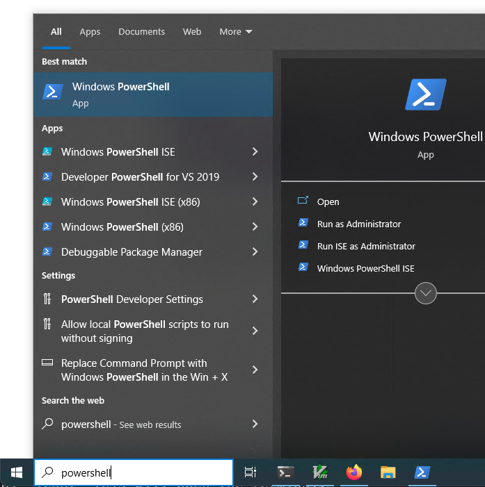

# Installation on Windows

## Powershell

Powershell is a Windows utility that allows you to type commands at a command
line prompt.  These types of applications are called *terminals* — because
they used to be the main way the people interacted with computers via computer
terminals.


### Windows 10

To start Windows Powershell on Windows 10:

*   Click on the Windows search bar, type "powershell".

    

    Notice that you want the "Windows Powershell" application, not "Windows
    Powershell ISE".
*   Then press return to run Powershell, or select "Run as Administrator" if
    you need to run administrator commands.  Usually prefer the normal mode (not administrator mode).
*   You should see a prompt a little like this:

    

### Windows 11

To start Windows Powershell on Windows 11, use "Windows Terminal".  It is the
most convenient way to start Powershell.   Follow one of the methods in [this
How-To Geek
page](https://www.howtogeek.com/831728/7-ways-to-open-windows-terminal-on-windows-11).  We recommend the second method: "From the Power User Menu".

## Chocalatey

We suggest you use [Chocolatey](https://chocolatey.org/) to install Git and
Python.

Go to the [Choclately install page](https://chocolatey.org/install) and follow
the instructions there.  Choose the 'individual' install.

To do the install, as that page says, open a Powershell window with
Administrator permissions.  For example, press the Windows key, type
"powershell", right-click on the "Windows PowerShell" option, chose "Run as
administrator".

A Powershell window will open.  Continue with the Choco install instructions, including checking, maybe setting the `ExecutionPolicy`.

## Git and Python

In the same, or a new Powershell administrator window, type:

```powershell
choco install -y git python
```

**Close the Powershell, and open it again, again with Administrator
privileges.**

To check the install, type:

```
get-command python
```

This should show something like this:

```
CommandType     Name         Version    Source
-----------     ----         -------    ------
Application     python.exe   3.10.41... C:\Python310\python.exe
```

If, instead, you see a value for "Source" that starts
`C:\Users\scipy\AppData\Local\Microsoft...`, either your install has failed,
or you have forgotten to close and restart the Powershell window after doing
the `choco install` step.  Just in case, do that now, and recheck the command
above.

## Copy python.exe to python3.exe

### The long-hand way

The output of `get-command python` above has shown you where Choco installed Python.  For example, as you've already seen, I got:

```
CommandType     Name         Version    Source
-----------     ----         -------    ------
Application     python.exe   3.10.41... C:\Python310\python.exe
```

If, instead, you see a value for "Source" that starts
`C:\Users\scipy\AppData\Local\Microsoft ...`, either your install has failed,
or you have forgotten to close and restart the Powershell window after doing
the `choco install` step.  Just in case, do that now, and recheck the command
above.

In my case, as you see above, Python was at `c:\Python310\python.exe`

Go to the directory containing Python.  In my case this was `c:\Python310`

```
cd c:\Python310
```

Then copy the `python.exe` file to `python3.exe`, so `python3` will also run the Python command.

```
cp python.exe python3.exe
```

### Copying the short-hand way

If you prefer, you can do this copy step by copy-pasting the code below to the
administrator Powershell prompt, and pressing Enter:

```powershell
$py_path = (get-command -CommandType Application -TotalCount 1 python).Source
cp $py_path ((Split-Path $py_path) + '\python3.exe')
```

## Check

Close the administrator Powershell window.

Open a new PowerShell window, not as administrator.  Try this command:

```powershell
get-command python3
```

You should see something like this:

```
CommandType     Name         Version    Source
-----------     ----         -------    ------
Application     python3.exe  3.10.41... C:\Python310\python3.exe
```

## An extra step

You need to make sure that your new commands, installed in the installation step, are available at the terminal.

To do this, you need to find the directory in which the new commands are
stored.  You can do this from your Powershell terminal.

```powershell
# Find the directory with the new commands.
$site_path=python3 -c "import site; print(site.USER_BASE + '\Python311\Scripts')"
echo $site_path
```

You should add this directory to the list of directories that Windows
searches for new programs.  This list of directories is called the "PATH".

You can do this via the GUI.

Here is how to add 

```
$user_path=[Environment]::GetEnvironmentVariable("PATH", "User")
[Environment]::SetEnvironmentVariable("PATH", "$user_path:$site_path", [System.EnvironmentVariableTarget]::User)
```


## To finish

Close the Powershell.  All done.
